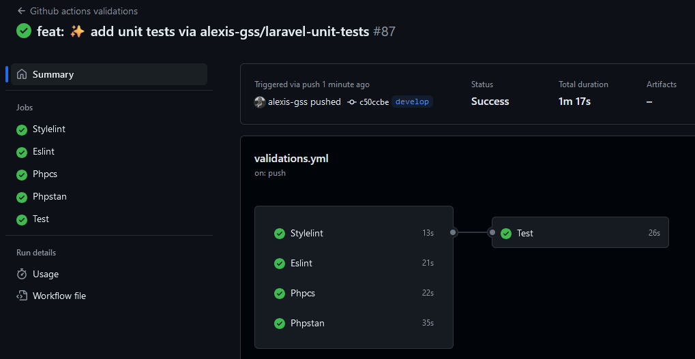
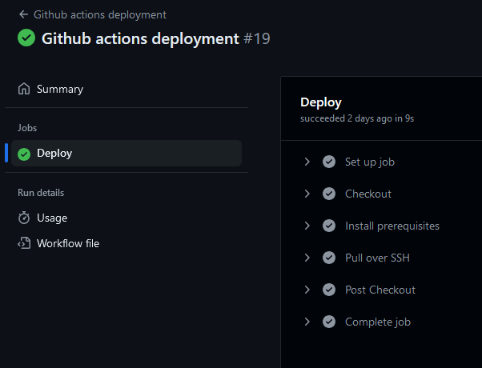

---
layout:
  title:
    visible: true
  description:
    visible: false
  tableOfContents:
    visible: true
  outline:
    visible: true
  pagination:
    visible: true
---

# 🗂️ Project management

[Games gallery](https://games-gallery.alexis-gousseau.com/) is a large-scale project, so a minimum of organization is required to develop it.

To achieve this, the entire project is managed on [Github](https://github.com/).

## Code saving

In fact, I save the entire code on this hosting service so that I can access it at **any time**, **anywhere**.

What's more, a whole host of features are already in place to help you organize your project. Whether it's being able to **exchange ideas** with other users of the service on a whole range of subjects, obtaining **a detailed history** of every modification made to the project, or knowing **the progress of a task**, Github has become essential in the realization of my projects.

## Creating of an issue

For the tasks I want to achieve, I create **an issue** on the [Github](https://github.com/) repository, categorizing it as **bug**, **evolution**, **documentation** or **questioning**. This allows me to organize the ideas that come to me in the form of a goal to be achieved.

<figure><figcaption>
Games Gallery - tasks list
</figcaption></figure>

Once the task description has been written, I start documenting and then developing the resolution of the problem or evolution. When I feel that the objective has been reached, I commit the modifications using the [Git versioning system](https://git-scm.com/) and categorize the task as completed. On the [Github](https://github.com/) side, I've set up **code checks** to list potential errors in code or conventions that haven't been respected, so that I can correct them in a future commit.

<figure><figcaption>
Games Gallery - github actions validations
</figcaption></figure>

Additionally, i added the [Laravel Unit Tests](https://packagist.org/packages/alexis-gss/laravel-unit-tests) in this project to test [CRUDs](../back-office/cruds.md) fonctionnalities and more. You can consult the [documentation for this package here](https://app.gitbook.com/o/teLlPYsR5WTBpd0PxleD/s/SJULvZ9iKnfqFF6afSUo/), which is also one of my creations.

Once the checks are complete, I merge the changes into the main version of the project and classify the task as finished. When this is done, it triggers another **github action**, which is deployment to the server via ssh:

<figure><figcaption>
Games Gallery - github actions deployment
</figcaption></figure>

## Versionning

What I've just described is the basic process I use to resolve bugs or small changes.

To keep track of all these tasks, I've set up a [semantic version](https://semver.org/) of the project. When I'm developing a new feature that will involve major changes, or when I feel the project has reached a new milestone, I create what's known as **a milestone**. The milestone is made up of a multitude of tasks and represents an important stage in the project's progress.

When this milestone is completed, the project is assigned a new major version (see all [Games Gallery](https://games-gallery.alexis-gousseau.com/) project versions in the next section).
