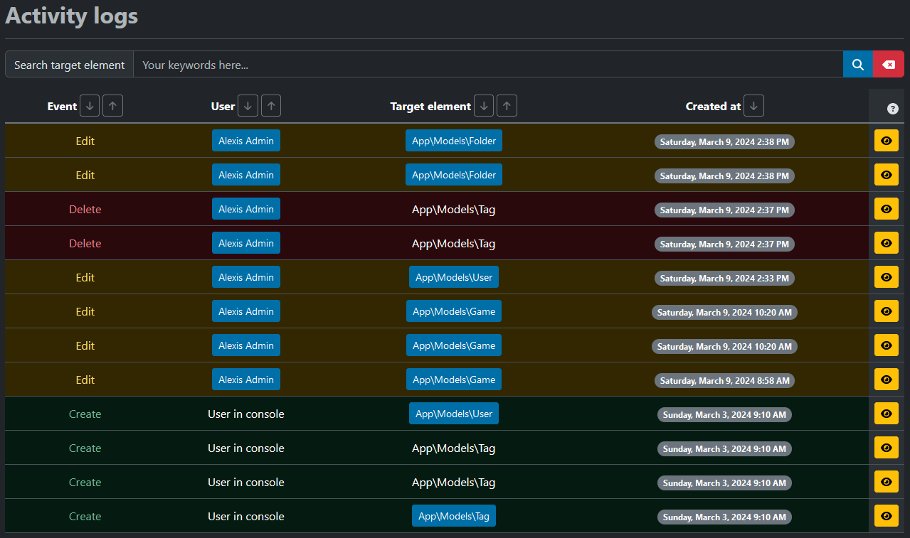

---
layout:
  title:
    visible: true
  description:
    visible: false
  tableOfContents:
    visible: true
  outline:
    visible: true
  pagination:
    visible: true
---

# 🗞️ Activity logs

This part of the project involves monitoring back-office activity on data models (previously discussed in the [CRUDs](cruds.md) section).

## Modifications

In this project, I've installed one of my packages called [Laravel Activity Logs](https://docs-laravel-activity-logs.alexis-gousseau.com/), which allows us to track **the author of each action**, **the target**, **the date** and all **the values modified** by the user. In this way, accounts with the designer role can track changes in detail and act accordingly.

<figure><figcaption>
Games Gallery - activity logs
</figcaption></figure>

When new activities are entered, this means that there have been changes concerning [CRUDs](cruds.md).

In order to have an overall view of the data stored in the database, I have created the [Statistics](statistics.md) page, which allows administrators to view the data in graphical form.
