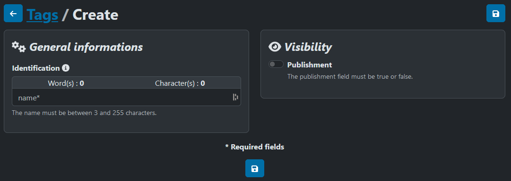
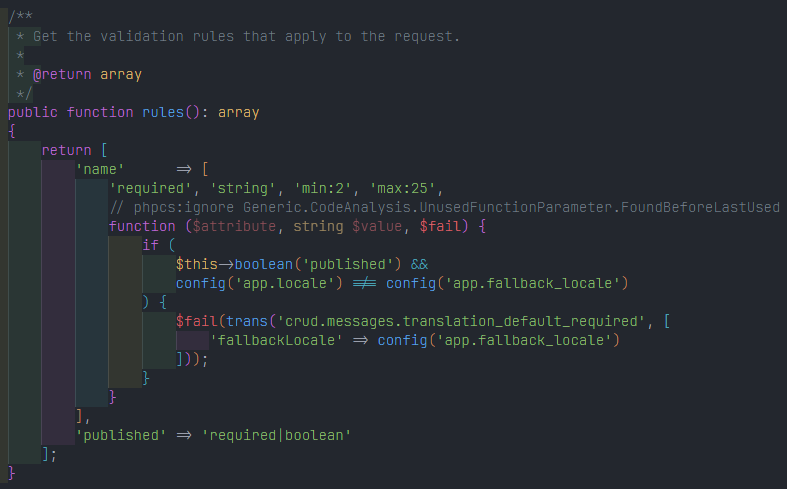
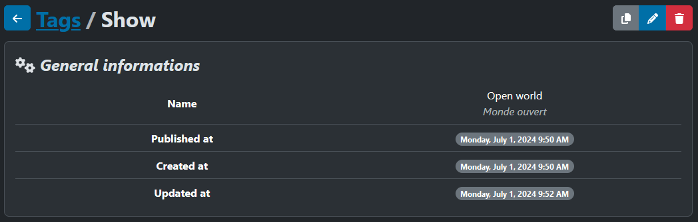
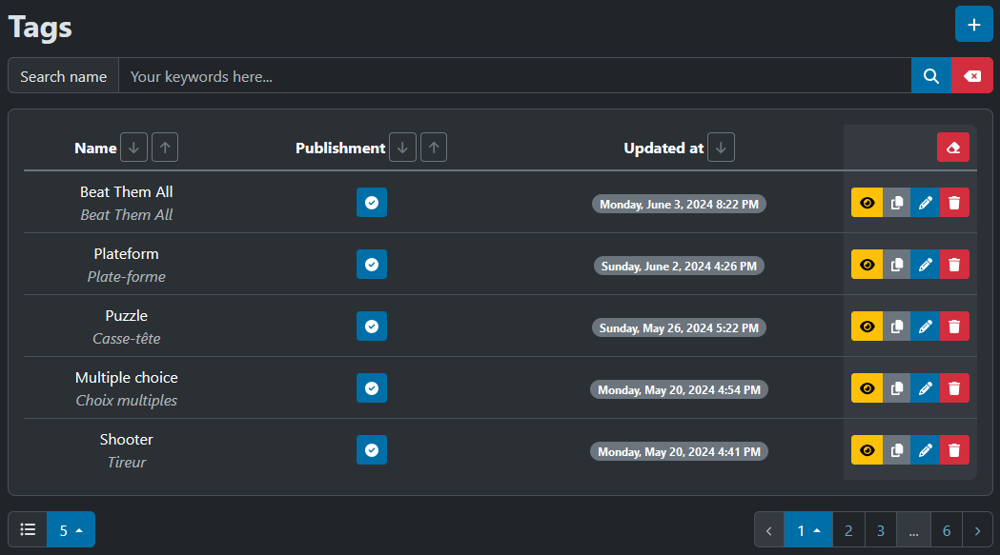
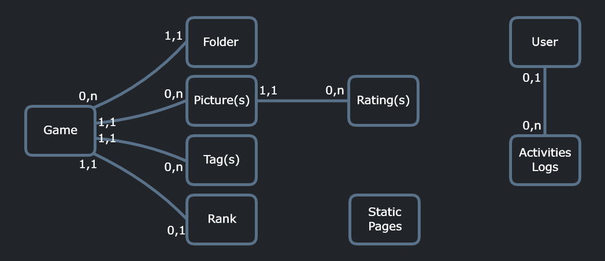

---
layout:
  title:
    visible: true
  description:
    visible: false
  tableOfContents:
    visible: true
  outline:
    visible: true
  pagination:
    visible: true
---

# 💾 CRUDs

Now we're getting down to the nitty-gritty of the project: CRUDs. For those who don't know, a CRUD has **4 main functions** for manipulating data: **Create**, **Read**, **Update** and finally **Delete** (for your information, I've also added the data **Duplication** function). I've therefore set up CRUDs to handle information linked to games, folders, tags, users and static pages (we'll use the CRUD dedicated to the **Tag model** for the example).

## Create

For each data model, you'll find the Create function, along with its page, which allows the user to **add a new entry** to the database:

<figure><figcaption>
Games Gallery - create page
</figcaption></figure>

The fields to be filled in are specific to their CRUD, since the information for a game is different from that for a folder or label, for example. Generally speaking, the data to be entered will be text for the name or a check/uncheck button dedicated to model visibility. When the form is sent, a data check is performed **to validate** format, length and other essential parameters.

<figure><figcaption>
Games Gallery - request validations
</figcaption></figure>

In addition, a **translation check** has also been implemented. Translatable text fields are mandatory in the default language (English) and optional in the others (currently **2 languages are available**, English and French).

To avoid having to go back and forth between information entry and validation feedback, **help texts** are provided below each field.

Once the information has been sent and validated, it is saved in the database and the user is **redirected to the editing page** for the freshly created model.

## Update

This brings us back to the CRUD Update function:

<figure><figcaption>
Games Gallery - update page
</figcaption></figure>

The information previously entered is added to the respective fields and **can be modified**. In the same way as for creation, when the form is submitted, this information is also validated, and the data model is subsequently updated.

## Delete

When this data is no longer relevant, the user can delete the data model by activating the CRUD Delete function. This deletes the information from the database and makes it no longer accessible **(this action is irreversible)**.

## Read

If the user simply wishes **to view the information in a data model** without modifying it, he can use CRUD's Read function, which will display the entire data set in read mode without the risk of being disturbed by other information.

<figure><figcaption>
Games Gallery - read page
</figcaption></figure>

## Duplicate

Finally, if the creation of a new entry seems similar to an existing model, the user can duplicate this data set **to create a new one with a base**. The rest of the process is exactly the same as for creation.

***

By now you're familiar with the CRUDs I've set up for **folders**, **games**, **tags**, **static pages** and **users**. In order to have a global view of the existing data models, I've set up a page for each CRUD that allows **indexing of all the models entered**. It contains the main information, as well as buttons for accessing the various functionalities I've detailed above.

<figure><figcaption>
Games Gallery - index page
</figcaption></figure>

## Organisation

By separating the data into several CRUDs, a certain structure can be established in the project. Here's **a diagram of the multiple relationships between data models** in the [Games Gallery](https://games-gallery.alexis-gousseau.com/) project:

<figure><figcaption>
Games Gallery - models relations
</figcaption></figure>

To create a new game, the user first need to create a folder to associate it with, as well as a few labels to classify it. Then he can access the new game creation page to select the images he wants.
