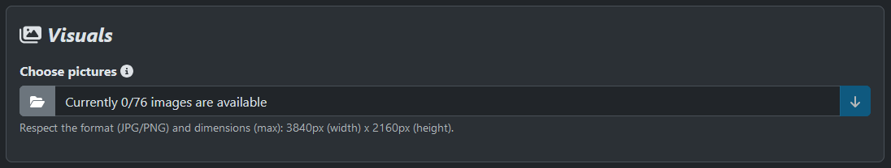

---
layout:
  title:
    visible: true
  description:
    visible: false
  tableOfContents:
    visible: true
  outline:
    visible: true
  pagination:
    visible: true
---

# 🖼️ Pictures

In order to fill in the main content of this [Games Gallery](https://games-gallery.alexis-gousseau.com/) project, which is the images, I've set up **a rather special feature**.

A **view component** is provided. By clicking on it, the user can select several images, between **0 and 76** to be precise. The choice of this number is very simple. When I completed a game, I rarely reached more than 74 images in total, and for the front display to be symmetrical (i.e. to end the last display line at 4 images), I needed exactly 76 images.

<figure><figcaption>
Games Gallery - game's pictures field
</figcaption></figure>

Once the images have been selected in the file explorer, they are sent directly as **chunks**. Each image is **split into small data packets**, and once all these have been sent, the image is **reconstructed and saved**.

This feature not only makes the site **easier to use**, as the user can fill in the other fields while waiting for the images to be sent in full, but also saves an **enormous amount of time and performance**. Indeed, sending images via a classic form, with just a file-type field and the multiple option, can take several tens of minutes, depending on the weight of the images selected (I reached around 25 minutes for fifty images). With this chunk feature, users can send their data in **less than a minute**, while **retaining total control over the current page**.

Once an image has been completely rebuilt, it is saved in a **default folder**. When the form is submitted on the creation page, all images previously sent are moved to a folder with the **name of the game**, and are then associated with the current model.

What's more, once an image has been uploaded, its format is **changed to .webp**, to **lighten and streamline the front-end display**, as explained earlier on the [front pictures page](../front-office/pictures.md). To notify the user of the progress of the image upload, a **progress bar** is visible for each element, with a percentage of completion. At 100%, the image can be viewed.

<figure><figcaption>
Games Gallery - send pictures
</figcaption></figure>

When at least one game has been published with images, it can be added to the project ranking.
