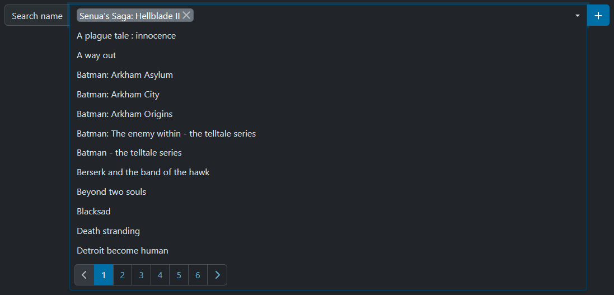
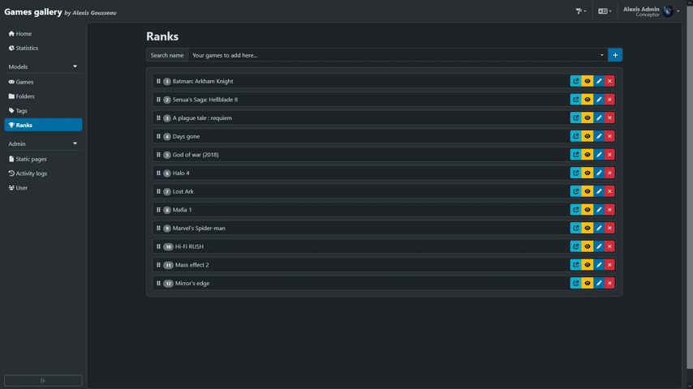

---
layout:
  title:
    visible: true
  description:
    visible: false
  tableOfContents:
    visible: true
  outline:
    visible: true
  pagination:
    visible: true
---

# 🥇 Ranking

In order to fill in the ranking page we saw earlier, a dedicated section has been created in the back-office.

This page operates differently from a CRUD. It consists of a selection field for existing games. The user can search for games by keyword, and then select them to add them to the list below.

<figure><figcaption>
Games Gallery - add game to the ranking 
</figcaption></figure>

Once done, a drag-and-drop system is used to reorganize all the items in the list. Each time a modification is made, an ajax call is executed to save directly to the database without having to constantly refresh the page.

<figure><figcaption>
Games Gallery - moving games in the ranking list
</figcaption></figure>

Each modification to a data model triggers a new entry in the project activity log.
