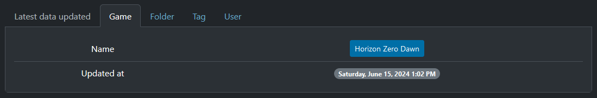

---
layout:
  title:
    visible: true
  description:
    visible: false
  tableOfContents:
    visible: true
  outline:
    visible: true
  pagination:
    visible: true
---

# 📊 Statistics

The back office of this [Games Gallery](https://games-gallery.alexis-gousseau.com/) project contains a multitude of data. That's why I wanted to set up a statistics section to give administrators an overview of all this information.

## Distribution

First, we find **the last entry** in each [CRUDs](cruds.md). Whether it's **a user**, **a folder**, **a game** or even **a tag**, we can see its name as well as the date and time of the change:

<figure><figcaption>
Games Gallery - latest entries
</figcaption></figure>

Next come the graphs showing the distribution of associations between data models. We have :

* a diagram tracking **project activities** over the last month :

<figure><figcaption>
Games Gallery - graph of activity logs
</figcaption></figure>

* a bar chart showing **the number of games per tags** :

<figure><figcaption>
Games Gallery - graph of games by tags
</figcaption></figure>

* a pie chart showing **the total number of games per folder** :

<figure><figcaption>
Games Gallery - graph of games by folders
</figcaption></figure>

As for the last part, it's simply **a top 5 of the most liked images** from the project :

<figure><figcaption>
Games Gallery - top 5 of rate by picture
</figcaption></figure>

Since only one person worked on it, project management was necessary to centralize ideas, bugs and evolutions.
