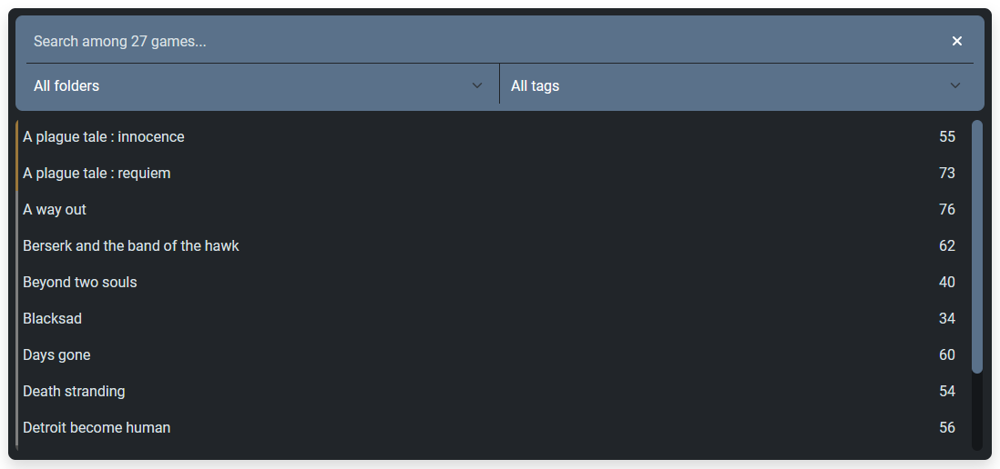
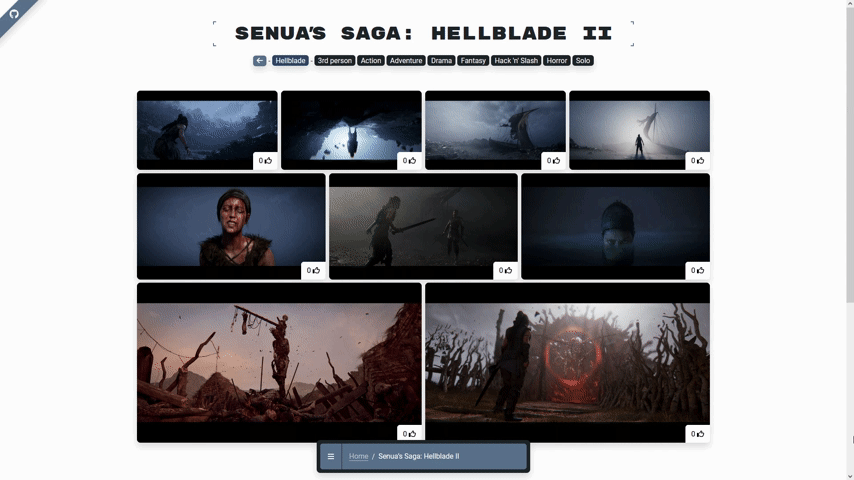
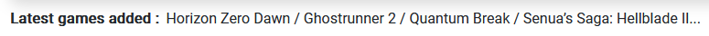
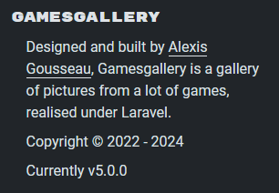
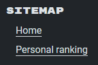
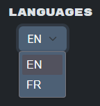
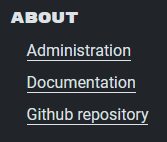

---
layout:
  title:
    visible: true
  description:
    visible: false
  tableOfContents:
    visible: true
  outline:
    visible: true
  pagination:
    visible: true
---

# 🏠 Home

Once the project has been set up, you can access the project home page:


Games Gallery - home page link


When you arrive at this page, you'll be presented with a wealth of information.

## Organization

There's a whole organization involved in data association.

The minimum you need to know at the moment is that **a game is associated with a folder** (a game license or common universe) and **can be assigned tags**, to categorize it.

## Navigation

Back to our home page, where you can search for existing games in the project. This can be done via a written text, or by the folder and/or tags with which the game is associated.

<figure><figcaption>
Games Gallery - navigation
</figcaption></figure>

The result of this search is a list of games with the following information:

* the name of the game
* the folder color
* the number of pictures taken

This feature, which searches and displays games in list form, is **a common part** of all front-office pages. This allows it to be used as a navigation, without changing the style to avoid losing users between pages.

In fact, browsing other pages behaves like this:

<figure><figcaption>
Games Gallery - page navigation
</figcaption></figure>

## News banner

On the home page, you'll find an information banner:

<figure><figcaption>
Games Gallery - lastest update
</figcaption></figure>

This scrolling text lists the **latest games updated** in the project. No action is required in this part, I simply wanted to create a permanent list of information, like those found on TV shows, to keep users up to date with the latest additions.

## Footer

When you reach the bottom of the page, you'll find the footer, which contains a wealth of important information.

A **short description** of the project and its version gives the user an idea of its purpose:

<figure><figcaption>
Games Gallery - footer part.1
</figcaption></figure>

To the right of the footer is the sitemap, which provides information on the **various existing pages** in which the user can navigate:

<figure><figcaption>
Games Gallery - footer part.2
</figcaption></figure>

Being French, I wanted this project to be available in a universal language, namely English, but also in my mother tongue. That's why a **language selector** is present:

<figure><figcaption>
Games Gallery - footer part.3
</figcaption></figure>

Finally, to find out more about the project, there's a link to **access the back-office part** of the project, which we'll look at later, but also **the documentation**, which you're currently on, and finally **the github repository** where all the code is hosted:

<figure><figcaption>
Games Gallery - footer part.4
</figcaption></figure>

Once all this data has been taken into account, the user can select a game from the navigation to discover all the photos taken in it.
