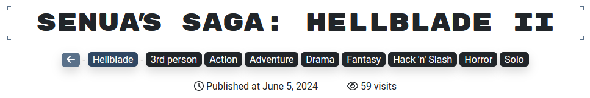

---
layout:
  title:
    visible: true
  description:
    visible: false
  tableOfContents:
    visible: true
  outline:
    visible: true
  pagination:
    visible: true
---

# 🖼️ Pictures

Once the game has been selected, the user is redirected to a page listing all the photos taken.


Games Gallery - example of a game page


## Informations

On arriving at this page, the user will be able to find several pieces of information: including the **name of the game**, a back button to return to the home page, **the name and color of the folder** to which it is associated, and **the tag(s) assigned to it**.

<figure><figcaption>
Games Gallery - example of a game page header
</figcaption></figure>

In this way, users know exactly what kind of game they're about to watch.

## Pictures

A list of images is offered to the user, who can select any of them to obtain a larger visual.

<figure><figcaption>
Games Gallery - image viewer
</figcaption></figure>

In addition, I've been thinking about optimizing this page:

* All images are displayed in sections. In fact, you only load one part at a time, thanks to page scrolling, with a maximum of **twelve images per part**. This allows you to split the loading of all images, even if the number of images is rather large.
* I've also set up **an image preloader**, so you can see how much space the image you're currently downloading will take up.
* Finally, the image format has been **adapted for the web (.webp)** in order to compress them as much as possible to keep their weight as low as possible, without losing any of their quality.

By combining these features, you get a site that's fluid in its navigation and content display, even if each image weighs its own weight.

## Rating

A rating system has also been added to this project. Indeed, on each image published, the current user will be able to give it **a positive vote**, according to his tastes. Once the like has been added or removed, a notification will appear on the site informing the user of the action he has just performed.

<figure><figcaption>
Games Gallery - rating picture
</figcaption></figure>

This system is fairly simple to set up, and is based **on secret key saved in cookie**. This way, on future visits to the site, he'll be able to find the likes he's added previously.

Once you've looked at a multitude of different images, you'll be able to come up with a purely personal ranking of the best games in the project.
