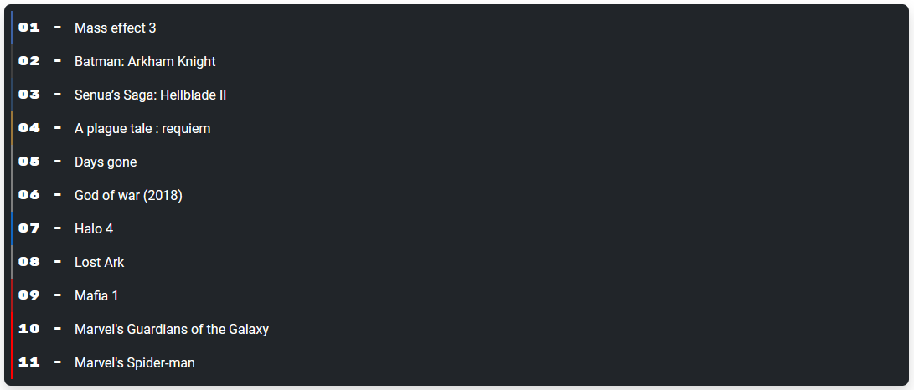

---
layout:
  title:
    visible: true
  description:
    visible: false
  tableOfContents:
    visible: true
  outline:
    visible: true
  pagination:
    visible: true
---

# 🥇 Ranking

Given the multitude of games I've been able to complete, I've developed a preference for some of them.


Games Gallery - ranking page link


That's what this page is all about, **highlighting some games** against others. Indeed, whether it's the game itself or the screenshots I've taken, I wanted to create a ranking to compare them.

<figure><figcaption>
Games Gallery - ranking
</figcaption></figure>

I've therefore opted for a position-based ranking of the best games I've played, which concludes the pages accessible to any average user.
